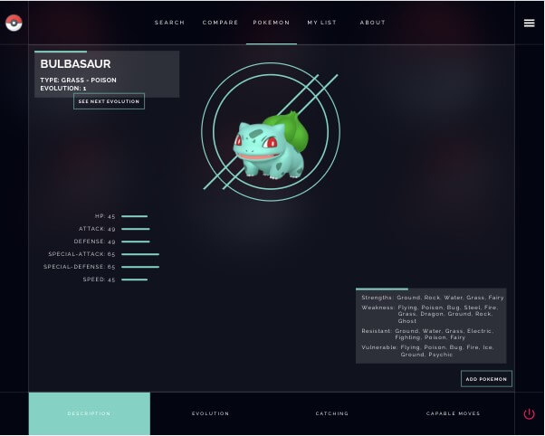
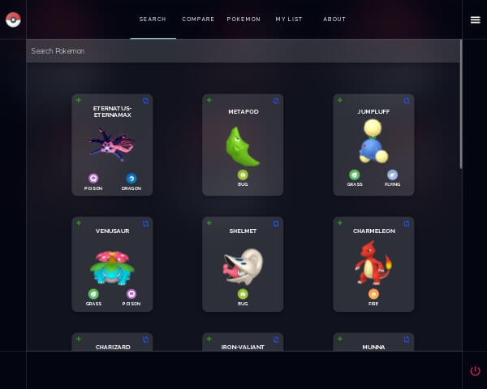
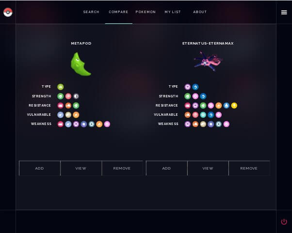
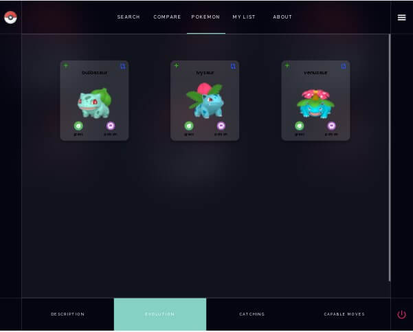
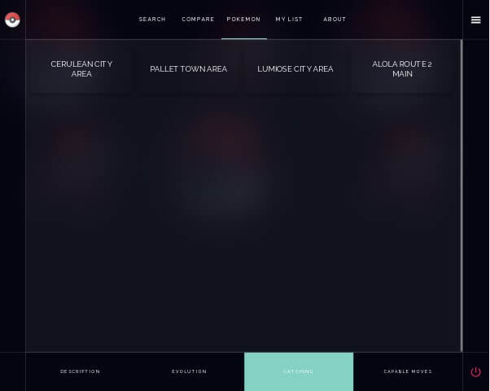
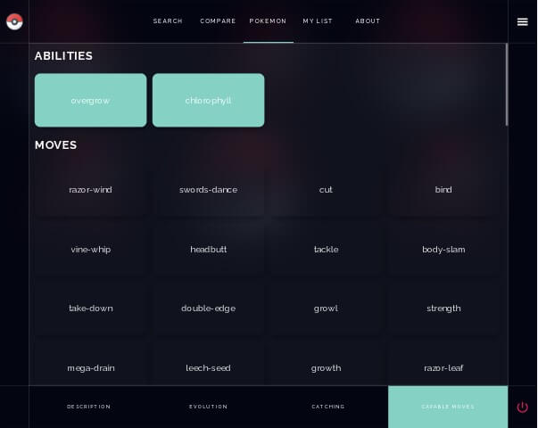
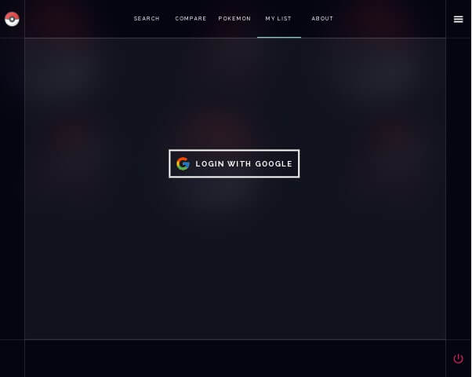
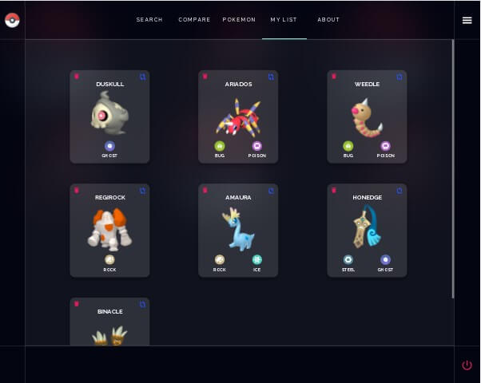
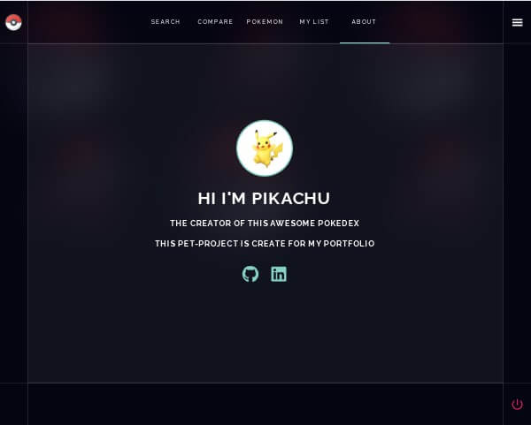

## Pokemon App

Pokemon App is amazing app where you can find a lot of different Pokemons from PokeAPI, compare them, create your own list and even add or delete them from it, see the evolution of Pokemons and find some extra information all about the Pokemons.

## Search Page

On this page you can find all Pokemons from PokeAPI. You can search pokemos here, add them to your collection or add them to compare. The Search page use the debouncing functionality of JavaScript to reduce the number of API calls that are made to the server.

## Compare Page

You can choise two different pokemons and compare them on this page. If you click on the view button it will redirect to the Pokemon Page where you can see more information about this Pokemon. Also you can add the Pokemon to your list(if you've been log-in) or delete the pokemon from this compare page.

## Pokemon Page

Here we have pokemon info: evolution level, name, batlae stats of the pokemon, types of the Pokemon.

If we click over - see next evolution – it’ll show you the different evolution level that this Pokemon has and when we click over any of that Pokemon then it will show you the evolution of that Pokemon. On the bottom of the page you can see the different tabs which will show you extra information about that Pokemon.

## My List Page

This page is created with Firebase functionality and to see all list of our pokemons we have to login with Firebase. When we click over this pop-up window will appear and it will sign in with your current Google account and then it will grab all your Pokemons that are in your firestore database.

## About Page

This page will show you about information and if you click over the buttons you‘ll be redirect to my
Github and Linkedin.

## Features

- Responsive Design: The website is designed to be fully responsive, adapting to different screen sizes starting from a minimum width of 320px.
- Loader: A loader is displayed during page loading, providing visual feedback to users while content is being fetched.

## Technologies Used

- React Hooks
- React Router
- CSS3 & SCSS
- Typescript
- Redux and Redux Toolkit
- Firebase
- Firestore
- Axios for API

## Thanks

A big thank [Kishan Sheth](https://github.com/koolkishan) for your tutorial &#128515;

## Contact Information

- **Linkedin:** [alekhandro-lagonavarro](https://www.linkedin.com/in/alekhandro-lagonavarro/)
- **GitHub:** [Alekhandro24](https://github.com/Alekhandro24)
- **Tel:** [+380507695110](+380507695110)
- **Email:** [lagoalekhandro@gmail.com](https://www.gmail.com)
